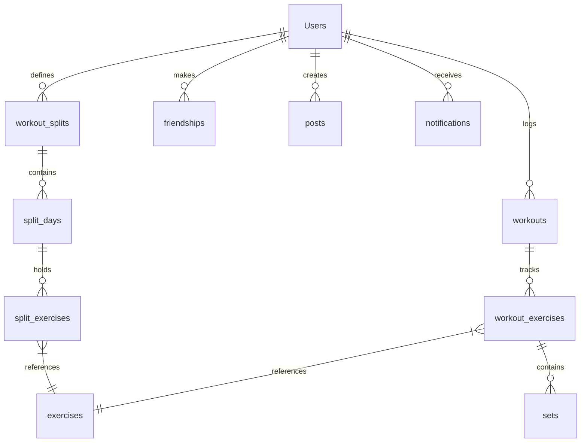

# Flex Fit 🏋️‍♂️💪

[](https://flutter.dev)
[](https://dart.dev)
[](https://supabase.com)

Welcome to **Flex Fit**, a state-of-the-art social fitness tracking application built using Flutter and Dart. Designed for lifters and fitness enthusiasts who want the professional logging capabilities of premium applications like Hevy or Strong, combined with a rich, real-time social networking system for sharing progress, posts, and stories.

---

## ✨ Recently Added Features

We have recently introduced several major features and enhancements to improve responsiveness, real-time feedback, and social connectivity:

### 1. 🔔 Reactive In-App Notification Center
A comprehensive notification framework built to keep users engaged and informed in real-time.
* **Database Backend**: Powered by a PostgreSQL `notifications` table on Supabase with enabled Row-Level Security (RLS) and real-time publications.
* **Database Triggers**: Auto-generates notifications directly inside the database on friendship updates (e.g. receiving or accepting a friend request) via PostgreSQL functions and triggers.
* **Realtime Syncing**: Built using a dynamic subscription channel (`SocialNotificationService`) to listen to notifications and friendship tables, instantly feeding notification badge indicators and updating lists.
* **Dashboard Feed**: Lists the latest 3 notifications directly on the primary dashboard view for quick reference.
* **Notifications Hub**: Accessible via the header bell icon, letting users view, delete, or mark all as read. Contains native actionable controls (e.g., *Accept* or *Decline* friend requests inline).
* **Simulated Event Testing**: Includes an in-app simulation bottom sheet (available via the `Icons.science_outlined` test button) allowing developers to trigger and test workout reminders, 3/7/30-day streak achievements, new friend signups, and mock friend requests on-the-fly.

### 2. 👥 Profile Friends Tracker & Navigation
Expanded social profiling to allow deeper user relationships.
* **Friends Count Indicator**: Profiles now display a dynamic counter of the user's active friendships.
* **Friends List Page**: Tapping the friends count routes the user to a dedicated `FriendsListPage`.
* **Interactive Search**: Users can search their list of friends in real-time or tap on a friend to inspect their workouts, personal records, and profile details. Includes quick navigation to discover and search new users globally.

### 3. 📱 Brand Identity & Rename (`Flex Fit`)
* Changed the native application name from `untitled6` to **`Flex Fit`**.
* Updated native configuration files (`AndroidManifest.xml`, build configurations, asset bundles, and string mappings) to reflect the new premium brand.

### 4. 📐 Responsive Dashboard Refactoring (`LayoutBuilder`)
* Refactored calorie trackers, workout history logs, and split progress widgets on the main dashboard page using Flutter's `LayoutBuilder`.
* Solved layout and height constraints, eliminating viewport overflows across small, large, or non-standard mobile screen resolutions.

### 5. 🌐 Production Web Authentication Callbacks
* Redirect URLs for authentication actions (like resetting/forgetting passwords and authentication deep links) have been updated from `localhost` to the production Netlify deployment URL, ensuring password recoveries operate seamlessly in staging and live environments.

---

## 🌟 Core App Features

### [A] Authentication & Session Management
* **Credentials Sign-In**: Secure email and password verification via Supabase Auth.
* **OAuth Integration**: Google Sign-In support for rapid, single-tap onboarding.
* **Deep-Linked Recovery**: Interactive "Forgot/Reset Password" pipelines routing users back into the app via deep links.
* **Session Persistence**: Shared Preferences cache to retain login states and fast-launch the app.
* **Premium Splash Screen**: Clean Lottie vector animation showing athletic loaders during authentication checks.

### [B] Interactive Dashboard
* **Fitness Analytics Panel**: Summarizes total workouts, total time elapsed, and estimated calories burned (Kcal).
* **Workout Calendar Feed**: Chronological list of logged workouts with metadata breakdowns.
* **Split Tracker**: Visual tracker indicating workout split program progression.

### [C] Routine & Split Builder
* **Custom Workout Splits**: Build specialized training cycles (e.g., Push/Pull/Legs, Arnold Split).
* **Day & Exercise Manager**: Add days, reorder, search, and attach exercises from the master list.
* **Templates Library**: Scrollable carousel loaded with premium visual pre-made program templates.

### [D] Active Workout Tracker
* **Live Session tracking**: Elapsed-time timer, set counting, and real-time total volume calculating.
* **Previous Performance Sync**: Displays the weights and reps logged during the user's *previous session* directly underneath the current active rows for prompt comparison.
* **Drag-and-Drop Reordering**: Long-press drag handles to reorder active workout routines on the fly.
* **Smart Database Prompts**: Prompts to update split templates permanently or save the session as a one-off modification upon completion.

### [E] Social Networking
* **Workout Share & Posts**: Media-rich social feed featuring comments, likes, and reposting.
* **Temporary Stories**: Expiration-linked visual updates loaded from the gallery/camera, grouped by user.
* **User Finder**: Global user directory search using emails or usernames.

### [F] Unit Converter & Analytics
* **Metric Converter**: Seamless toggle between kilograms (`KG`) and pounds (`LBS`) with automated floating-point mathematical conversions application-wide.
* **PR Milestones**: Personal Record goal setters showing progress bars that turn gold upon reaching 100%.

---

## 🛠️ The Tech Stack

* **Core Framework**: Flutter & Dart (SDK `^3.11.3`) supporting Material 3 guidelines.
* **Backend Database**: Supabase (PostgreSQL, Auth, and Storage Buckets).
* **State Management**:
  * **BLoC/Cubit**: Handles reactive, frequent events (such as the workout timer, social interactions, and real-time notification streams).
  * **Provider**: Manages app-wide configurations (e.g., Dark/Light Theme Switching) and views.
* **Plugins**: `lottie`, `image_picker`, `url_launcher`, `shared_preferences`, `supabase_flutter`.

---

## 🗄️ Database Architecture

The PostgreSQL database is organized into the following relational structures:



### Table Breakdown
1. **`Users`**: Relational metadata matching authenticated auth records (id, username, fullname, email, weight_kg, image_url).
2. **`notifications`**: User alerts (id, user_id, title, message, type, is_read, created_at).
3. **`exercises`**: Global catalog of exercises, descriptions, and links.
4. **`workout_splits`**: User-defined routines.
5. **`split_days`**: Days within split templates (e.g., Day 1: Pull).
6. **`split_exercises`**: Exercises mapped to specific split days.
7. **`workouts`**: Completed user workout sessions.
8. **`workout_exercises`**: Exercises executed within a logged workout session.
9. **`sets`**: Specific set data (reps, weight, completion status) mapped to executed exercises.
10. **`friendships`**: Relational maps tracking connection status (`pending`, `accepted`).
11. **`posts` / `post_likes` / `post_comments` / `post_reposts`**: Core components of the Social Engine.
12. **`stories` / `story_views`**: Temporary stories expiring in 24 hours.

---

## 📁 Project Directory Layout

```
lib/
├── Pages/
│   ├── AddExercise/         # Searching, choosing, and adding exercises to custom splits
│   ├── Components/          # Global shared UI elements (CustomBottomNavBar, errorsnackbar)
│   ├── Dashboard/           # Statistics panels, history feeds, and notification cards
│   ├── ExerciseDetails/     # Specific exercise catalog and guides
│   ├── ExerciseHistory/     # Timeline metrics of personal lifting records
│   ├── ForgotPassword/      # Passwords reset portals
│   ├── Login/               # Authentication credentials panels
│   ├── Notifications/       # In-App Notification Center UI & ViewModel (Recently Added!)
│   ├── Profile/             # Profile settings, conversion toggles, and friends index
│   ├── SignUp/              # Account registration forms
│   ├── Social/              # Infinite feed posts, comment view, and story views
│   ├── Splash/              # Lottie splash screen checking login persistence
│   ├── StartWorkout/        # Split selection menu
│   ├── WorkoutBegin/        # Live elapsed-workout session logging (Cubit)
│   ├── WorkoutDetail/       # Log summaries for executed historical sessions
│   ├── WorkoutRoutine/      # Split customization screens
│   └── WorkoutSplit/        # Wizard builder tools
├── services/
│   ├── services.dart        # Supabase API endpoints connector
│   ├── sharedpref.dart      # Device storage caching
│   ├── theme_service.dart   # Dark / light configuration provider
│   └── settings_service.dart# Units preferences helper
└── main.dart                # Entry gateway setting up services and route pathways
```

---

## 🚀 Getting Started & Build Instructions

### Prerequisites
* Flutter SDK (`^3.11.3`)
* Android Studio / Xcode (for emulation)
* A configured Supabase project (load database tables via `scheema.txt`)

### Run Locally
1. Clone the repository and navigate to the project directory:
   ```bash
   git clone <repository_url>
   cd flex_fit
   ```
2. Retrieve packages:
   ```bash
   flutter pub get
   ```
3. Run the development server or build for mobile devices:
   ```bash
   flutter run
   ```
